# Using Clusters in Node.js with Express

**Author:** Alejandra Fernández López

This project demonstrates the performance advantages of using clustering in a Node.js environment. By comparing a single-threaded application against a clustered one, we can observe how Node.js handles CPU-intensive tasks and improves availability.

---

## 1. Prerequisites

Before starting, ensure you have the following environment and tools configured:

Server: A virtual machine running Ubuntu 22.04 LTS (Jammy Jellyfish), configured via Vagrant.

Access: SSH connection to the guest machine.

Environment: Node.js and npm installed on the machine.

Networking: A bridge adapter configured to allow access via http://[VM-IP-Address]:3000.

---

## 2. Implementation with Clusters

### 2.1 Single-Process Execution (Without Clusters)

To understand the benefits of clustering, we begin with a standard Node.js application. Node.js is single-threaded by nature, meaning this version can only handle one heavy task at a time.

**Application Code** (app.js):
```
const express = require("express");
const app = express();
const port = 3000;
const limit = 5000000000;

app.get("/", (req, res) => {
  res.send("Hello World!");
});

app.get("/api/:n", function (req, res) {
  let n = parseInt(req.params.n);
  let count = 0;
  
  if (n > limit) n = limit;
  
  for (let i = 0; i <= n; i++) {
    count += i;
  }
  
  res.send(`Final count is ${count}`);
});

app.listen(port, () => {
  console.log(`App listening on port ${port}`);
});
```
**Setup Steps:**

1. SSH into your Ubuntu machine: Use vagrant ssh or your preferred SSH client.

2. Create a project directory

3. Initialize the project:
    ```
     Run npm init -y
    ```
    ```
     Run npm install express to install the framework.
    ```

4. Start the application


5. Testing:

 · Open http://[VM-IP-Address]:3000/api/50. 

 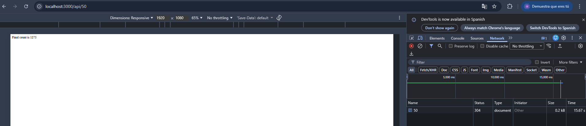

· Open http://[VM-IP-Address]:3000/api/5000000000.


 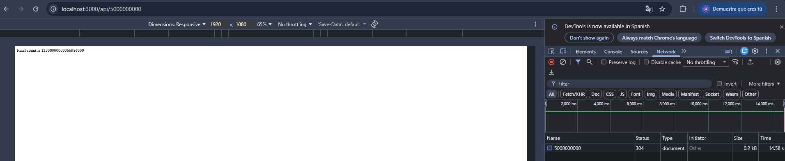

 The first request, having a large value of n, takes a few seconds to complete.

The second request, despite having a value of n that we had already verified produced an almost immediate response, also takes a few seconds to complete.

### 2.2 Using Clusters

Now, we will use the Cluster module to generate multiple child processes. This modification significantly improves the application's responsiveness by allowing it to handle multiple concurrent requests.

**Application Code** (cluster_app.js):

```
const express = require("express");
const port = 3000;
const limit = 5000000000;
const cluster = require("cluster");
const totalCPUs = require("os").cpus().length;

if (cluster.isMaster) {
  console.log(`Number of CPUs is ${totalCPUs}`);
  console.log(`Master ${process.pid} is running`);

  // Fork workers.
  for (let i = 0; i < totalCPUs; i++) {
    cluster.fork();
  }

  cluster.on("exit", (worker, code, signal) => {
    console.log(`worker ${worker.process.pid} died`);
    console.log("Let's fork another worker!");
    cluster.fork();
  });
} else {
  const app = express();
  console.log(`Worker ${process.pid} started`);

  app.get("/", (req, res) => {
    res.send("Hello World!");
  });

  app.get("/api/:n", function (req, res) {
    let n = parseInt(req.params.n);
    let count = 0;

    if (n > limit) n = limit;

    for (let i = 0; i <= n; i++) {
      count += i;
    }

    res.send(`Final count is ${count}`);
  });

  app.listen(port, () => {
    console.log(`App listening on port ${port}`);
  });
}
```

Now we will repeat the same experiment as before; first, we make a request to the server with a high value of n:

 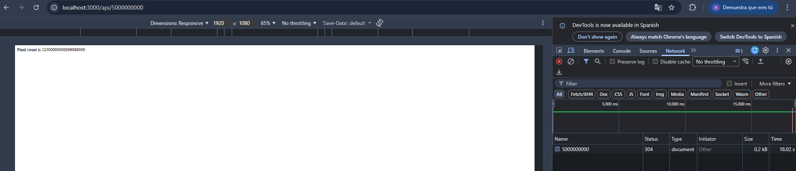

 And we quickly execute another request in a different browser tab, measuring the processing times of both:

 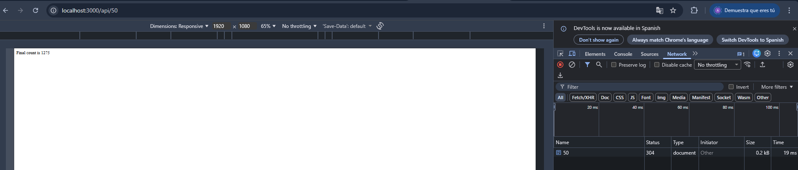

 ---

 ## 3. Performance Metrics

 To quantify the difference between a single-process and a clustered application, we will perform a load test. This allows us to simulate high traffic and measure how each version handles a large volume of concurrent incoming connections.

 ### 3.1. Testing the Non-Clustered Version

First, start the application that does not use clusters (node app.js). While it is running, open a second terminal and execute the load test.

### 3.1. Tool Installation: loadtest
We will use the loadtest package, which provides detailed metrics such as total execution time, mean latency, and requests per second (RPS).

Install the package globally:

```
npm install -g loadtest
```

### 3.2. Testing the Non-Clustered Version
First, start the application that does not use clusters `(node app.js)`. While it is running, open a second terminal and execute the load test.

**Test 1:** Moderate Load (n = 500,000) Run 1,000 total requests with 100 concurrent clients:

```
loadtest http://localhost:3000/api/500000 -n 1000 -c 100
```

 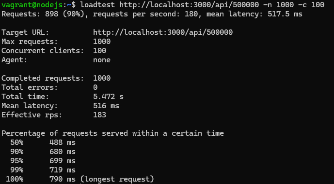

 **Test 2:** High Load (n = 500,000,000) Now, we simulate a much more intensive operation using the same request count and concurrency:

```
loadtest http://localhost:3000/api/500000000 -n 1000 -c 100
```

 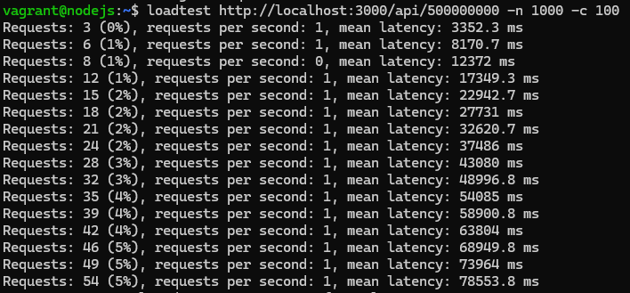

 Now, we stop the single-process application and launch the clustered version `(node cluster_app.js)`. We will execute the exact same tests to provide a direct comparison.

 **Test 1:**  Moderate Load (n = 50,000) with Clusters

  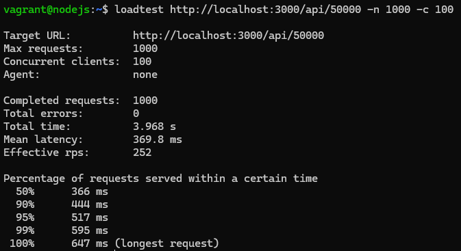

 **Test 2:** High Load (n = 500,000,000) with Clusters

  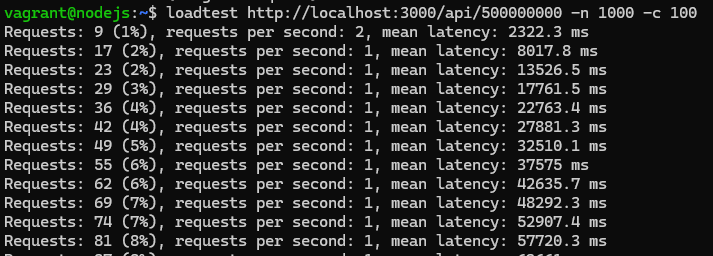

  It is clear that clusters make it possible to handle a larger number of requests per second with lower latency.

  ---

## 4. Using PM2 to Manage a Node.js Cluster

###  4.1. Installation

To use PM2, install it globally on your Ubuntu system:

```
npm install pm2 -g
```

### 4.2. Running a Non-Clustered App in Cluster Mode

We can take our first version (app_no_cluster.js) and force it to run as a cluster using the following command:

```
pm2 start app_no_cluster.js -i 0
```
 
 Once executed, PM2 will display a table showing the status, ID, mode (cluster), and resource consumption (CPU/Memory) of each worker process.

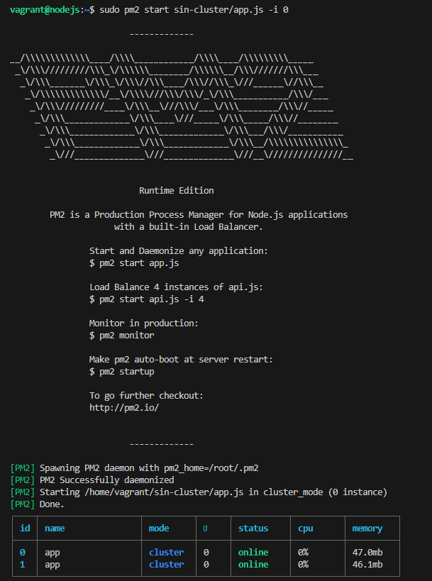

To stop all processes associated with the app, use:

```
 pm2 stop app_no_cluster.js.
 ```

 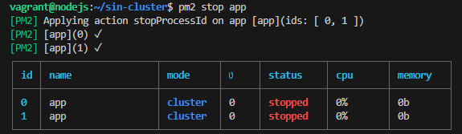

### 4.3. Advanced Configuration: The Ecosystem File
Instead of passing arguments via the command line every time, PM2 allows the use of a configuration file called Ecosystem.

1. Generate the file:

```
pm2 ecosystem
```

2. Edit `ecosystem.config.js`: Modify it to include your application details:

```
module.exports = {
apps: [{
name: "nombre_aplicacion",
script: "nombre_aplicacion_sin_cluster.js",
instances: 0,
exec_mode: "cluster",
},
],
};
```

Now, you can manage your entire stack with a single command:

```
pm2 start ecosystem.config.js
```

### 4.4 Explore commands

`pm2 ls`: Displays a list of all managed processes, showing their status, uptime, and resource usage.

`pm2 logs`: Provides real-time log output from all workers, which is essential for debugging.

`pm2 monit`: Opens an interactive dashboard in the terminal to monitor CPU and Memory usage in real-time.

 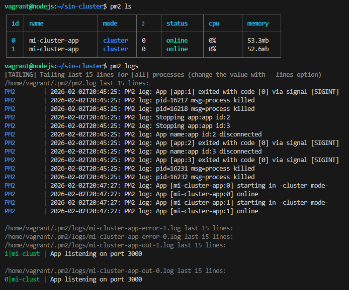

 

  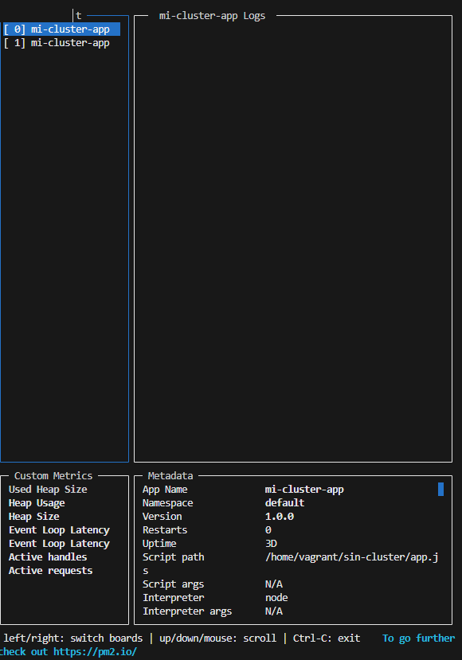

  ## 5. Questions

 *Why does the single-process sometimes outperform the cluster?*
 
 In our testing with small values of $n$ (such as $n = 50$ or $n = 5000$), the single-process application achieved slightly better metrics (lower latency and higher RPS) than the clustered version. This occurs due to Overhead Management.
 
 Key Factors:
 
 - Inter-Process Communication (IPC): When using a cluster, the Master process must distribute incoming connections to the Workers. This internal communication and management layer adds a small amount of "administrative" time to every request.
 
 - Context Switching: The operating system must manage multiple processes simultaneously. For extremely fast tasks, the time the CPU spends switching between these processes can be greater than the time it takes to simply execute the code in a single thread.
 
 - Task Complexity: When a task is very simple (low n), the overhead of the cluster architecture is more noticeable than the benefit of parallelism.

 **Conclusion:** Clustering is not for all scenarios. It is highly effective for CPU-intensive tasks or high-traffic environments where blocking the event loop is a risk. However, for very simple, lightweight operations, a single-process execution can be more efficient as it avoids the architectural complexity of a cluster.


